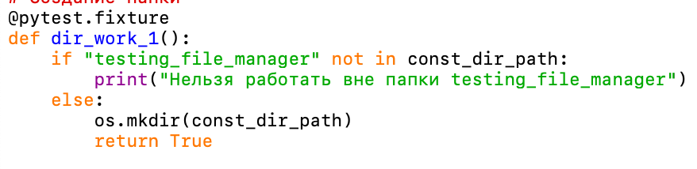
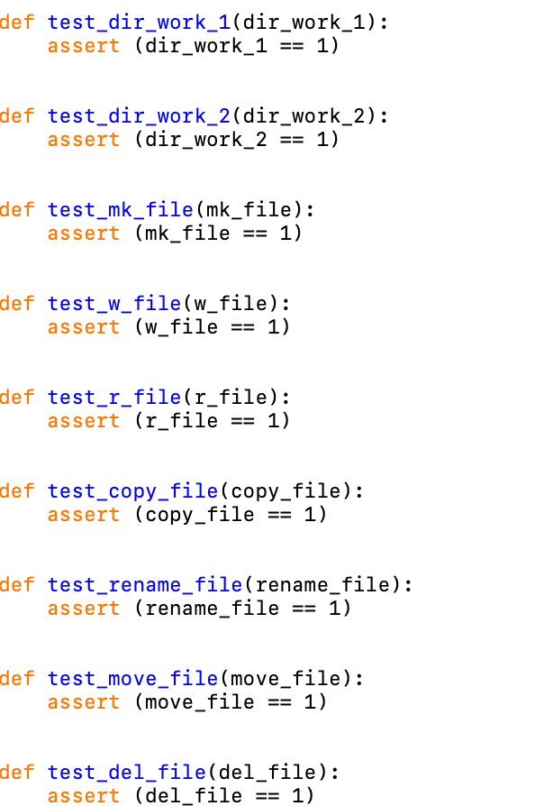
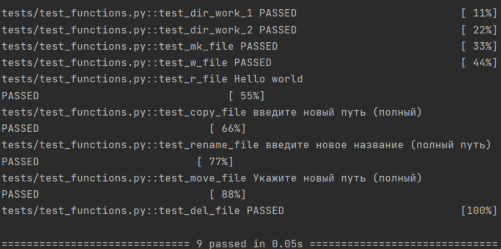

# Задание 2 

tests- директория, в которой находятся файлы с тестами, в нашем случае, для упрощения проверки - 1 файл.

filemanager.py - файл с файловым менеджером.

Я подгрузила Pytest в конфигурацию проекта.

Алгоритм тестировки будет проводиться с использованием фикстур.

Фикстура для создания папки выглядит так:

Результат тестирования pytest:

